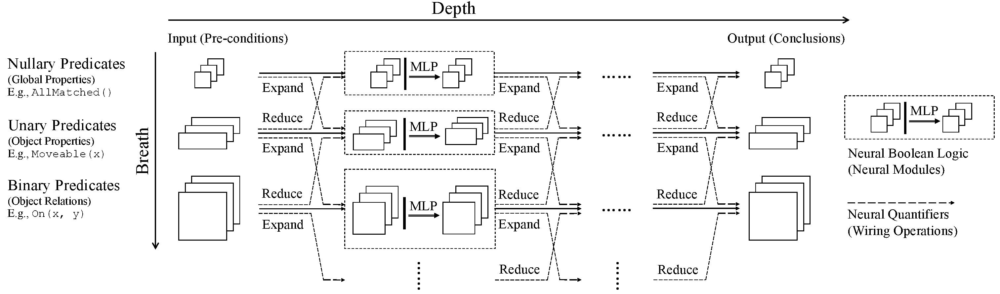

# Neural Logic Machines
PyTorch implementation for the Neural Logic Machines (NLM). **Please note that this is not an officially supported Google product.**

<div align="center">
  
</div>

Neural Logic Machine (NLM) is a neural-symbolic architecture for both inductive learning and logic reasoning. NLMs use tensors to represent logic predicates. This is done by grounding the predicate as
True or False over a fixed set of objects. Based on the tensor representation, rules are implemented
as neural operators that can be applied over the premise tensors and generate conclusion tensors.

**[Neural Logic Machines](https://arxiv.org/pdf/1904.11694.pdf)**
<br />
[Honghua Dong](http://dhh1995.github.io)\*,
[Jiayuan Mao](http://jiayuanm.com)\*,
[Tian Lin](https://www.linkedin.com/in/tianl),
[Chong Wang](https://chongw.github.io/),
[Lihong Li](https://lihongli.github.io/), and
[Denny Zhou](https://dennyzhou.github.io/)
<br />
(\*: indicates equal contribution.)
<br />
In International Conference on Learning Representations (ICLR) 2019
<br />
[[Paper]](https://arxiv.org/pdf/1904.11694.pdf)
[[Project Page]](https://sites.google.com/view/neural-logic-machines)

```
@inproceedings{
      dong2018neural,
      title     = {Neural Logic Machines},
      author    = {Honghua Dong and Jiayuan Mao and Tian Lin and Chong Wang and Lihong Li and Denny Zhou},
      booktitle = {International Conference on Learning Representations},
      year      = {2019},
      url       = {https://openreview.net/forum?id=B1xY-hRctX},
    }
```

## Prerequisites
* Python 3
* PyTorch 0.4.0
* [Jacinle](https://github.com/vacancy/Jacinle). We use the version [ed90c3a](https://github.com/vacancy/Jacinle/tree/ed90c3a70a133eb9c6c2f4ea2cc3d907de7ffd57) for this repo.
* Other required python packages specified by `requirements.txt`. See the Installation.

## Installation

Clone this repository:

```
git clone https://github.com/google/neural-logic-machines --recursive
```

Install [Jacinle](https://github.com/vacancy/Jacinle) included as a submodule. You need to add the bin path to your global `PATH` environment variable:

```
export PATH=<path_to_neural_logic_machines>/third_party/Jacinle/bin:$PATH
```

Create a conda environment for NLM, and install the requirements. This includes the required python packages
from both Jacinle and NLM. Most of the required packages have been included in the built-in `anaconda` package:

```bash
conda create -n nlm python=3.6 

conda activate nlm

# find the version for your OS and cuda version
# https://download.pytorch.org/whl/cpu/torch_stable.html
wget https://download.pytorch.org/whl/cpu/torch-0.4.0-cp36-cp36m-linux_x86_64.whl 
pip install torch-0.4.0-cp36-cp36m-linux_x86_64.whl 
 
pip install numpy==1.19.5
pip install tqdm==4.64.1
pip install scikit-learn==0.21.0
pip install matplotlib==2.2.4
pip install PyYAML==6.0.1
pip install certifi==2016.9.26
pip install cycler==0.11.0
pip install importlib-resources==5.4.0
pip install joblib==1.1.1
pip install kiwisolver==1.3.1
pip install Pillow==8.4.0
pip install pyparsing==3.1.1
pip install python-dateutil==2.9.0.post0
pip install pytz==2024.1
pip install six==1.16.0
pip install threadpoolctl==3.1.0
pip install zipp==3.6.0
```

## Usage

This repo contains 10 graph-related reasoning tasks (using supervised learning)
and 3 decision-making tasks (using reinforcement learning).

We also provide pre-trained models for 3 decision-making tasks in [models](models) directory,

Taking the [Blocks World](scripts/blocksworld) task as an example.

``` shell
# To train the model:
$ jac-run scripts/blocksworld/learn_policy.py --task final
# To test the model:
$ jac-run scripts/blocksworld/learn_policy.py --task final --test-only --load models/blocksworld.pth
# add [--test-epoch-size T] to control the number of testing cases.
# E.g. use T=20 for a quick testing, usually take ~2min on CPUs.
# Sample output of testing for number=10 and number=50:
> Evaluation:
    length = 12.500000
    number = 10.000000
    score = 0.885000
    succ = 1.000000
> Evaluation:
    length = 85.800000
    number = 50.000000
    score = 0.152000
    succ = 1.000000
```

Please refer to the [graph](scripts/graph) directory for training/inference details of other tasks.

### Useful Command-line options
- `jac-crun GPU_ID FILE --use-gpu GPU_ID` instead of `jac-run FILE` to enable using gpu with id `GPU_ID`.
- `--model {nlm, memnet}`[default: `nlm`]: choose `memnet` to use (Memory Networks)[https://arxiv.org/abs/1503.08895] as baseline.
- `--runs N`: take `N` runs.
- `--dump-dir DUMP_DIR`: place to dump logs/summaries/checkpoints/plays.
- `--dump-play`: dump plays for visualization in json format, can be visualized by our [html visualizer](vis). (not applied to [graph tasks](scripts/graph/learn_graph_tasks.py))
- `--test-number-begin B --test-number-step S --step-number-end E`: \
  defines the range of the sizes of the test instances.
- `--test-epoch-size SIZE`: number of test instances.

For a complete command-line options see `jac-run FILE -h` (e.g. `jac-run scripts/blocksworld/learn_policy.py -h`).
